# Setup de Ambiente

Serão apresentadas aqui informações úteis para contribuir para o desenvolvimento
do aplicativo Localiza ZARP

## Android

**Pré-requisitos:**

Para suportar o desenvolvimento da aplicação é necessário ter instalado no computador as seguintes ferramentas:

- Python 2
- Java na versão 10.0 para se tornar compatível com a versão suportada pelo aplicativo.
- Android Studio na versão 3.6.2+
- Android SDK API 28+
- Gradle 5.6.2
- Emulador sugerido:
  - Phone: Pixel 2
  - Target: Android 9
  - API Level: 28

Windows:

Recomenda-se que limpe seus caches na pasta raíz do seu usuário se possuir uma versão anterior do Gradle e/ou JDK na máquina.
Para facilitar a instalação você pode utilizar o Chocolatey que é uma ferramenta de linha de comando baseada em Powershell para instalar programas de forma similar ao brew do MacOSX ou apt-get no Linux.

A instalação do Chocolatey pode ser realizada através deste guia: https://chocolatey.org/install

Após isto você pode utilizar o comando abaixo para instalar as ferramentas necessárias automáticamente:

```sh
choco install -y python2 ojdkbuild androidstudio
```

Mac:

```sh
brew install watchman
brew cask install adoptopenjdk/openjdk/adoptopenjdk10
```

Após a instalação o Android Studio, ele solicitará que se complete a instalação da ferramenta:

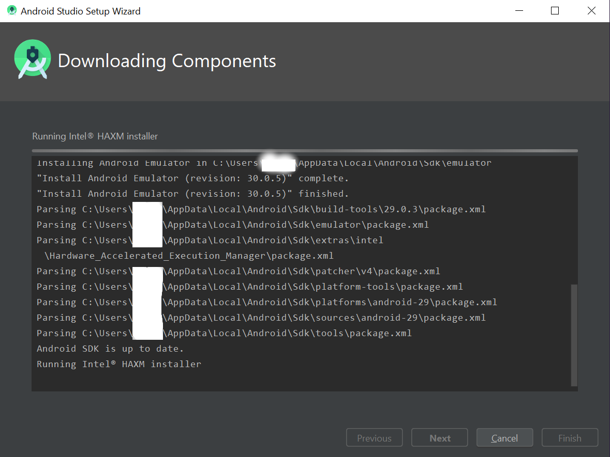

Caso encontre erro ao criar a virtualização Hyper-V abaixo:

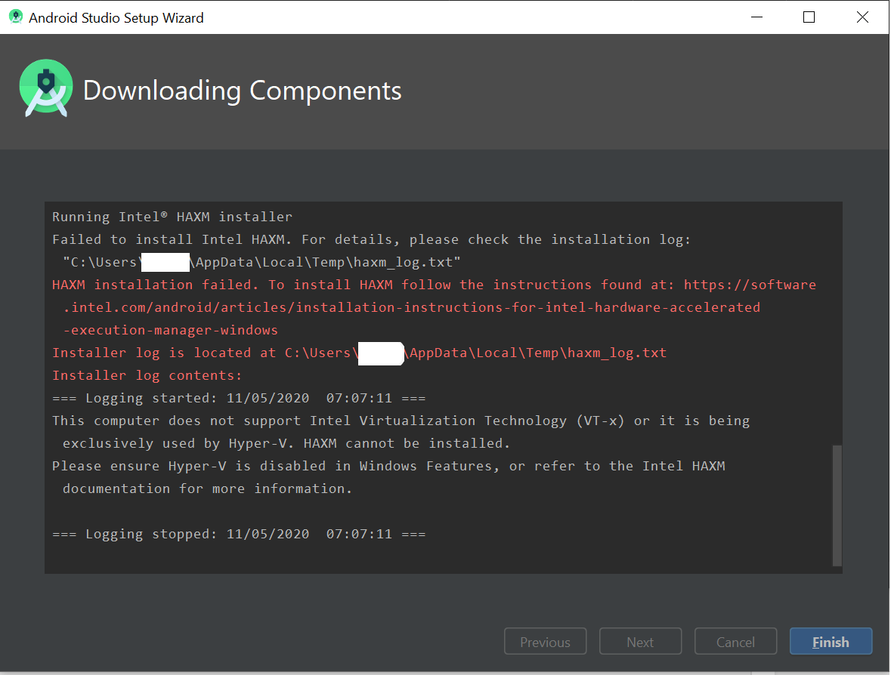

Ative o Hyper-V seguindo o link abaixo, execute os comandos via Powershell:

https://docs.microsoft.com/en-us/virtualization/hyper-v-on-windows/quick-start/enable-hyper-v

Antes de continuar, siga para os passos do React Native, finalize-os, abra a pasta android na raíz do projeto no Android Studio:

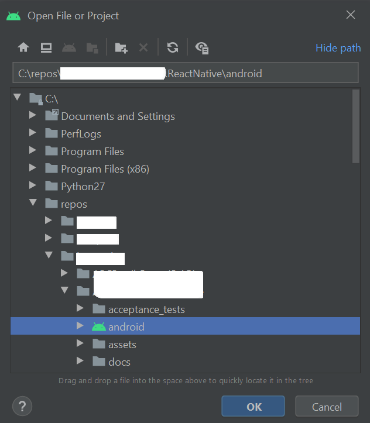

O android studio cuidará de instalar as ferramentas restantes necessárias e realizar o Make do projeto, inclusive da versão utilizada do gradle 5.6.2:

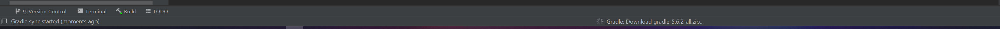

Após a instalação automática do gradle, o projeto iniciará a sincronização na aba build. Aguarde enquanto o make é realizado:

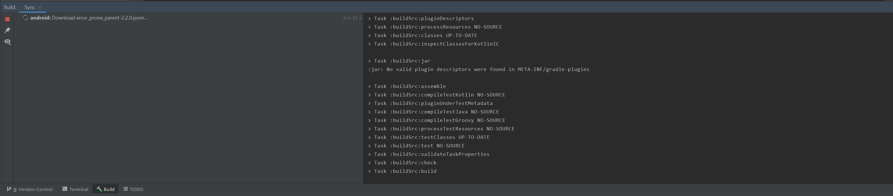

Caso sua instalação tenha falhado, talvez você tenha que aceitar a licença do sdk do Android:

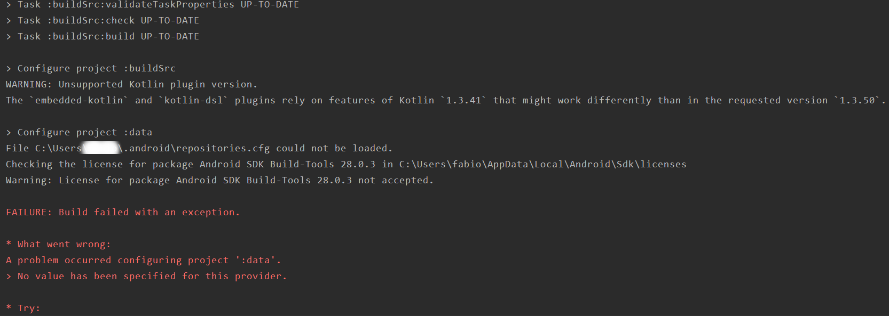

Clique no menu em File > Settings > Appearance and Behavior > Android SDK e instale o Android 9 API 28:

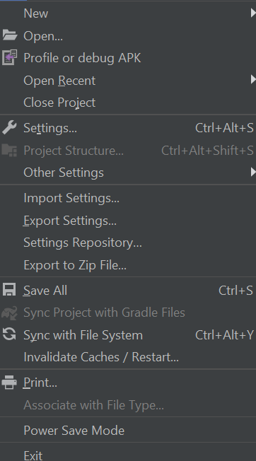

E o command line sdk tools:

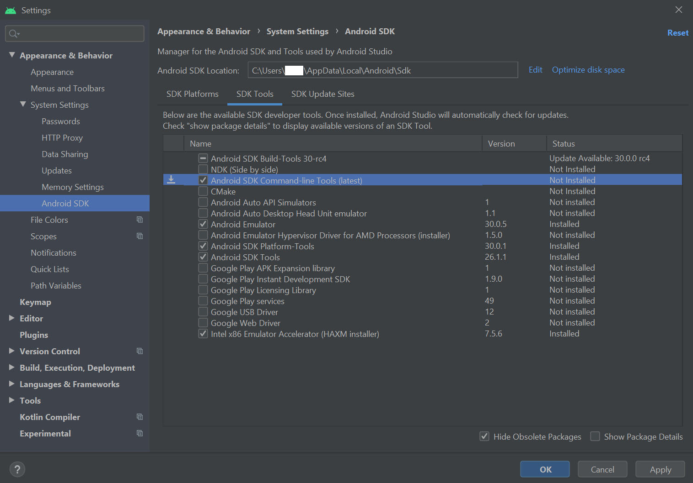

Aceite as licenças e finalize a instalação.

Sincronize o projeto novamente clicando em Sync Project with Gradle Files:


O projeto sincronizará com sucesso. Para abrir o aplicativo crie um novo emulador:

https://developer.android.com/studio/run/managing-avds?hl=pt-br

Em seguida selecione o módulo de apresentação presentation e clique no botão run:

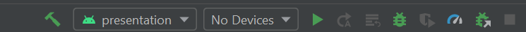

### Variáveis de ambiente

Para terminar de configurar as variáveis de ambiente siga os passos abaixo:

Adicione as seguintes linhas na $HOME/.bash_profile ou $HOME/.bashrc (se estive usando o zsh então ~/.zprofile ou ~/.zshrc):

```sh
export ANDROID_HOME=$HOME/Library/Android/sdk
export PATH=$PATH:$ANDROID_HOME/emulator
export PATH=$PATH:$ANDROID_HOME/tools
export PATH=$PATH:$ANDROID_HOME/tools/bin
export PATH=$PATH:$ANDROID_HOME/platform-tools
```

Dúvidas acesse a documentação do [React Native](https://reactnative.dev/docs/environment-setup)

## iOS

**Pré-requisitos:**

Para suportar o desenvolvimento da aplicação é necessário ter instalado no computador as seguintes ferramentas:

- XCode 11.3.1
- Apple Simulator Utils

```sh
brew tap wix/brew
brew install applesimutils
```

Para terminar de configurar o XCode siga os passos da documentação do [React Native](https://reactnative.dev/docs/environment-setup)

## React Native

- Node JS na versão 10.0.0 ou superior, recomendamos o uso de Node Version Manager

  ```sh
  curl -o- https://raw.githubusercontent.com/nvm-sh/nvm/v0.35.3/install.sh | bash

  ```

- Yarn 1.x

  Windows:

  ```sh
  choco install yarn
  ```

  Mac:

  ```sh
  brew install yarn
  ```

Com as ferramentas instaladas vá até a raiz do projeto onde está o arquivo `package.json` e utilize o comando `yarn install` ou `npm install` para realizar o download de todas as dependências necessárias para executar o projeto react native.

Quando o download estiver concluído você terá uma pasta com o nome _node_modules_ no mesmo local que está o arquivo `package.json` com todas as dependências do projeto instaladas.

**Testar o Ambiente:**

Com as configurações acima instaladas você precisa selecionar nas seguintes plataformas as configurações de dev, para evitar que dados utilizados durante o desenvolvimento caia em ambiente de produção:

- **Android** - Você deve selecionar a build vairant `developmentDebug` no android studio
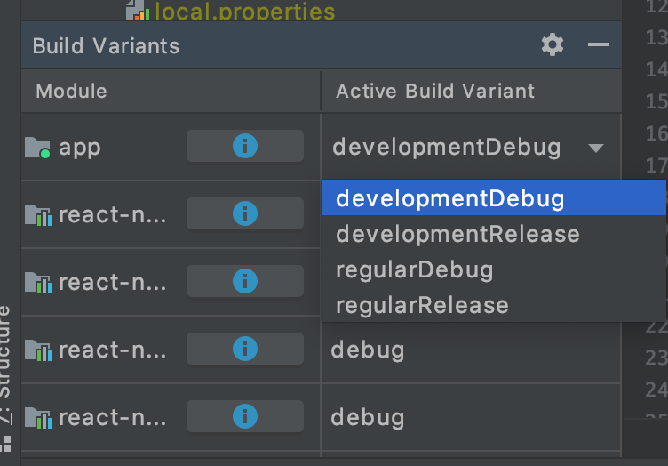
- **iOS** - Você deve selecionar o scheme `zarpDev` no Xcode
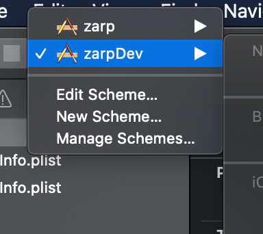

- Verificar se o react-native está instalado e configurado da forma correta:

  ```sh
  yarn android
  ```

  ou

  ```sh
  yarn ios
  ```

Com esse comando será aberto o emulator/simulador, compilada e executada a aplicação para a respectiva plataforma em modo de desenvolvimento.

Caso tenha problemas para carregar o _bundle_ no dispositivo (**Android**), execute o seguinte comando:

```sh
adb devices
```

Copie o nome do dispositivo e substitua no comando abaixo.

```sh
adb -s <emulator/device name> reverse tcp:8081 tcp:8081
```

**Release em múltiplos ambientes**

Nosso app gerencia múltiplos ambientes com a lib `react-native-dotenv`, por padrão as varáveis do ambiente são carregadas do arquivo `.env`, no momento de fazer release, usar o seguinte comando para alterar os valores para o ambiente desejado:

```sh
yarn setEnv <development | homolog | production>
```
